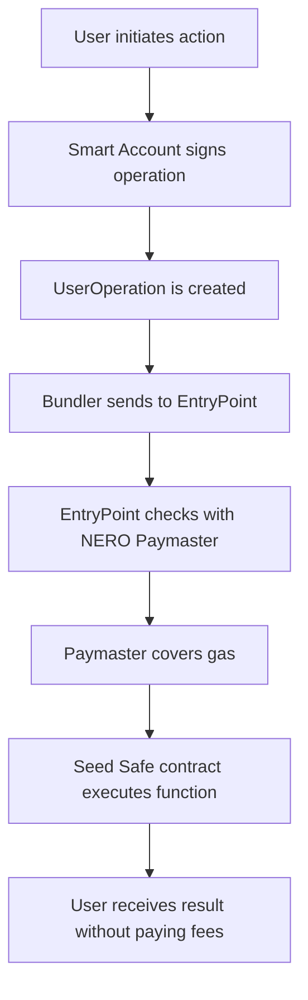

# Detailed implementation of NERO Paymaster

## Introduction

&emsp;This section presents the proposal for using NERO Chain’s Paymaster system within the Seed Safe platform. Based on the ERC-4337 (Account Abstraction) infrastructure, NERO’s Paymaster allows users to perform transactions without paying gas fees — a key factor for the adoption of a fluid, accessible, and inclusive Web3 experience.

## What is the Paymaster and How It Will Be Used

&emsp;The Paymaster is a component of the ERC-4337 standard responsible for covering the gas costs of `UserOperations` (abstract operations) sent by users’ Smart Accounts. Seed Safe will use the **Paymaster provided by NERO Chain**, with no need to develop a custom contract.

This model will enable:

- 100% gasless transactions for farmers and investors  
- Simplified onboarding for users with no token balance  
- Seamless integration with NERO’s AA infrastructure  

## Integrated Architecture (Using NERO’s Paymaster)

| Component            | Technical Role                                                              |
|----------------------|------------------------------------------------------------------------------|
| NERO Paymaster        | Sponsors the platform’s UserOperations                                      |
| EntryPoint (NERO)     | Executes operations validated and paid for via the Paymaster                |
| Bundler (NERO)        | Forwards signed UserOperations to the network                               |
| Smart Account (SDK)   | Represents the user as an abstract wallet                                   |
| AgriFinance.sol       | Accumulates platform fees and may subsidize Paymaster usage in the future   |

## How the Paymaster Will Be Indirectly Funded

&emsp;Although Seed Safe won’t develop its own Paymaster, the platform will use a **financial sustainability model** through:

- A fee applied to commercial transactions (e.g., crop token purchases)  
- Fund collection and management via the `AgriFinance.sol` contract  
- Future possibility of using part of this fund to subsidize or sponsor the Paymaster via partnerships or NERO extensions  

&emsp;This model ensures the platform continues offering a gasless experience at scale without compromising financial sustainability.

## Gasless Transaction Flow

## Practical Example

1. Ana, an investor, purchases 100kg of crop via Seed Safe.  
2. The operation is packaged as a `UserOperation` by her Smart Account.  
3. The Bundler sends it to the NERO network.  
4. EntryPoint queries NERO’s native Paymaster.  
5. The Paymaster covers the transaction gas.  
6. Ana receives the tokens and certificate without spending anything on fees.

## Security

&emsp;Since NERO’s Paymaster already includes built-in validations, Seed Safe won’t need to implement a custom authorization system. Security is ensured by:

- Limits defined by the NERO SDK and infrastructure  
- Use of well-known, public contracts on the network  
- Integration only with functions that make sense for end users  

## Integration Steps

1. Integrate an AA-compatible SDK (e.g., StackUp, Alchemy) in the front-end  
2. Set up automatic Smart Account creation upon accessing Seed Safe  
3. Connect the front-end to NERO’s Paymaster through SDK configuration  
4. Test gasless operations (e.g., `buyToken`, `mintCombo`) via UserOperation  
5. Monitor Paymaster performance and consumption over time  

## Conclusion

&emsp;Seed Safe will leverage NERO’s Paymaster system to allow its users to interact with the platform without technical or financial barriers. By adopting a reliable and secure existing infrastructure, the platform reduces technical complexity and accelerates implementation time, maintaining focus on a seamless experience and scalable solution.

## Bibliography
- SINGH, Aniket Kumar et al. Account abstraction via singleton entrypoint contract and verifying paymaster. In: 2023 2nd International Conference on Edge Computing and Applications (ICECAA). IEEE, 2023. p. 1598-1605.
- OJOG, Silviu; MIRON, Alina-Andrea. Account Abstraction: The Key to Blockchain Reporting. Informatica Economica, v. 28, n. 3, p. 73-81, 2024.
- WANG, Qin; CHEN, Shiping. Account abstraction, analysed. In: 2023 IEEE International Conference on Blockchain (Blockchain). IEEE, 2023. p. 323-331.